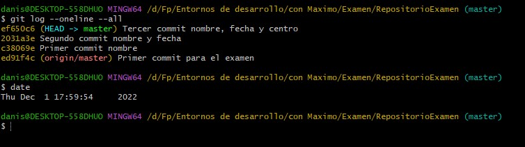
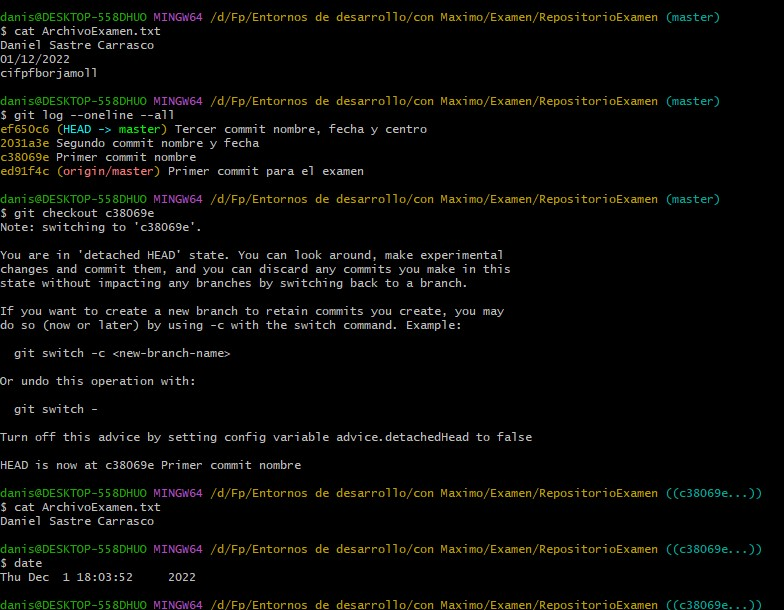
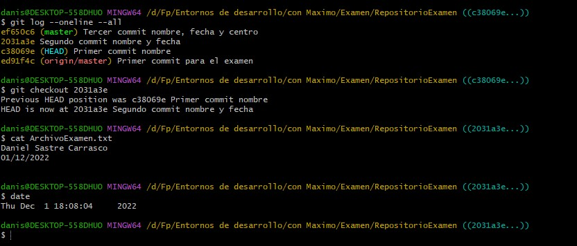
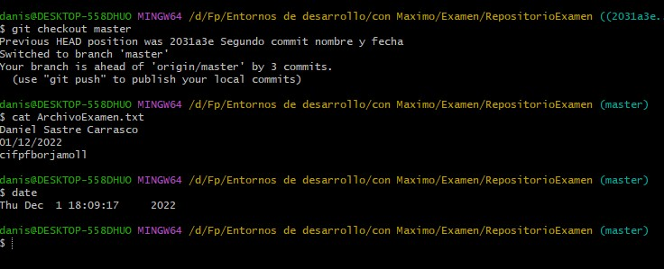

# Examen Entornos de Desarrollo

##Practica 1 

Crear un directorio con git Bash iniciamos con el comando git init

---

Como se puede ver, al hacer git status -s tengo un archivo, el cual esta en rojo y con ?? porque esta en seguimiento por git, añadirlo uso el comando git add . asi lo añado todo, tambien podria poner el nombre del archivo en vez del punto asi solo cogeria el archivo en cuestio y no todo lo que se encuentre dentro 

---

Ahora que ya tengo seguimiento de nuestro archivo, para crear una copia an nuestro repositorio local hacemos un commit por el cual guardamos klo que tenemos hecho hasta ese momento de nuestro archivo 

---

Cuando ya tenemos commits realizados, podemos guardar estas copias que hemos hecho en un repositio online como puede ser en gitHub, por lo tanto lo primero es crear una conexion con el repositorio con el comando git remote add origin y la url del repositio. Asi podemos hacer un push, el cual subira nuestro archivo de nuestro repositorio local a este repositorio online.

---

##Practica 2 

He hecho unos cuanto commit sobre el archivo txt para poder movernos por estos commit, en la siguiente imagen se puden ver un log de los diferentes commmit que se han realizado

---

Al realizar un cat sobre nuestro archivo podemos ver que nos salen los 3 datos que tenemos nombre, fecha y centro, pero con el checkout volvemos a la version 1 la cual solo tenia el nombre, por ello al usar el cat sobre el archivo podemos ver que por culpa de aquel checkout que usamos para volver a la primera version ha funcionado y solo nos imprime el nombre

---

Ahora volvemos a hacer lo mismo que antes pero en vez de ir a la version 1 hemos ido a la version 2 ahora al hacer el cat ya nos sale el nomber y la fecha 

---

Finalmente volvermos a la version final, por lo cual al usar el checkout no hace falta poner el numero de commit, si nos con master nos lleva a la ultima version, así podemos ver que al hacer el cat sobre el archivo nos sale el ultimo commit que realizamos y nos sale nombre, fehca y centro  

##Preguntas Teoria

#a 
El directorio de trabajo es aquel en el cual tenemos la conexion con nuestro git, por ello los archivo tienen que estar guardados en este directorio, si nos no pueden tener un mantenimiento sobre ellos

#b
es el proceso medio entre realizar un commit y mantener un seguimiento sobre nuestro archivo, es una preparacion para relizar una "foto" sobre nuestro archivo, es el proceso de add antes del commit 

#c
El repositorio local, es el sitio en nuestro pc donde se guardan las diferentes copias de los archivos que hacemos commit, por lo cual al hacer un push se suben al repositorio online, 
